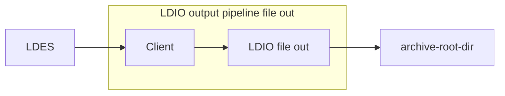

# Apache Nifi File Out

<b>Apache Nifi processor name:</b> <i>```ArchiveFileOutProcessor```</i>

<br>


The LDIO File Out is used to write models to files based on a timestamp path property on the model.
Please refer to the [core documentation](../../core/ldi-outputs/file-archiving) for more information.



## Pipeline configuration example

```yml
- name: client-pipeline
  description: "Requests all existing members from a public LDES server and keeps following it for changes, sending each member as-is to a webhook"
  input:
    name: be.vlaanderen.informatievlaanderen.ldes.ldi.client.LdioLdesClient
    config:
      url: ${LDES_SERVER_URL}
      sourceFormat: application/n-quads
  outputs:
    - name: be.vlaanderen.informatievlaanderen.ldes.ldio.LdioHttpOut
      config:
        endpoint: ${SINK_URL}
        rate-limit:
          enabled: true
          max-requests-per-minute: ${MAX_REQUESTS_PER_MINUTE}
```

## LDIO Config

| Property         | Description                                   | Required | Default | Example                                   | Supported values                |
| :--------------- | :-------------------------------------------- | :------- | :------ | :---------------------------------------- | :------------------------------ |
| archive-root-dir | The root directory where files are written to | Yes      | N/A     | /parcels/archive                          | Linux (+ Mac) and Windows paths |
| timestamp-path   | The timestamp path used for naming the        | Yes      | N/A     | http://www.w3.org/ns/prov#generatedAtTime | Any valid LD predicate          |
