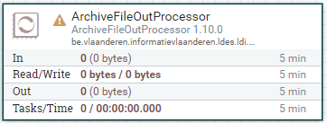

# Apache Nifi SPARQL Construct

<b>Apache Nifi processor name:</b> <i>```SparqlConstructProcessor```</i>



An LDIO wrapper component for the [LDI SPARQL Construct building block](../../core/ldi-transformers/sparql-construct)

## Config

| Property | Description                                              | Required | Default | Example  | Supported values |
| :------- | :------------------------------------------------------- | :------- | :------ | :------- | :--------------- |
| query    | Path to content of SPARQL Query/content of SPARQL query. | Yes      | N/A     | query.rq | Path/String      |
| infer    | Include original model in end result.                    | No       | false   | false    | true or false    |
