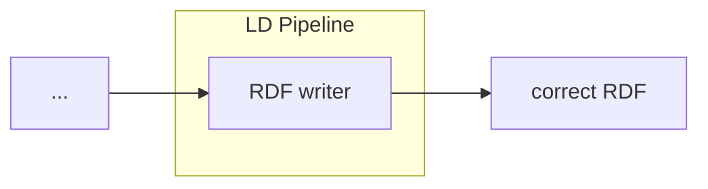

# LDIO Json To JsonLd Transformer

<b>LD Pipeline Component Name:</b> <i>```be.vlaanderen.informatievlaanderen.ldes.ldi.JsonToLdAdapter```</i>

<br>

An LDIO wrapper component for the [LDI Json To JsonLd building block](../../core/ldi-adapters/json-to-json-ld)




## Example

```yml
orchestrator:
  pipelines:
    -   name: example
        adapter:
            name: be.vlaanderen.informatievlaanderen.ldes.ldi.JsonToLdAdapter
            config:
                core-context: http://example.com/my-api
```


## Config

| Property     | Description                    | Required | Default | Example                   | Supported values    |
| :----------- | :----------------------------- | :------- | :------ | :------------------------ | :------------------ |
| core-context | URI of a core json-ld context. | Yes      | N/A     | http://example.com/my-api | HTTP and HTTPS urls |
