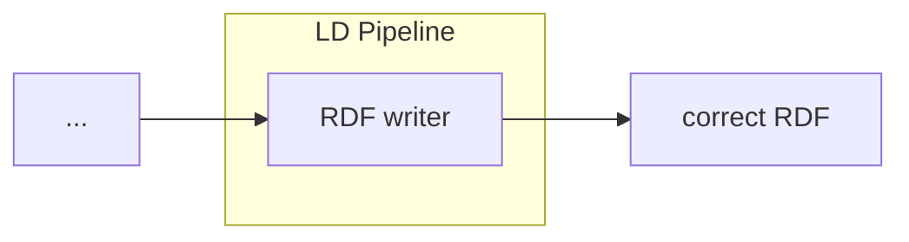

# LDIO RDF Adapter

<b>LD Pipeline Component Name:</b> <i>```be.vlaanderen.informatievlaanderen.ldes.ldi.RdfAdapter```</i>

<br>

An LDIO wrapper component for the [LDI RDF Adapter building block](../../core/ldi-adapters/rdf-adapter)




## Example

```yml
orchestrator:
  pipelines:
    -   name: example
        adapter:
            name: be.vlaanderen.informatievlaanderen.ldes.ldi.RdfAdapter
```


## Config

This component has no required config
