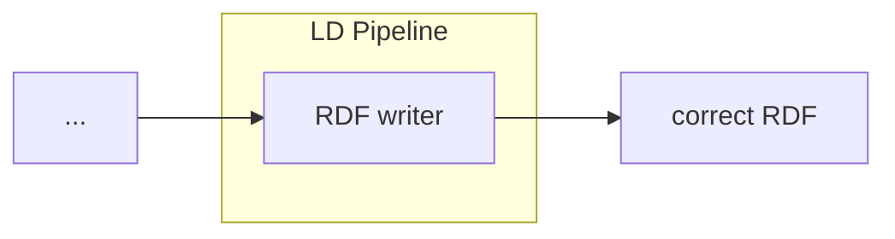

# LDIO RML Adapter

<b>LD Pipeline Component Name:</b> <i>```be.vlaanderen.informatievlaanderen.ldes.ldi.RmlAdapter```</i>

<br>

The RML Adapter allows a user to transform a non-LD object (json/CSV/XML) to an RDF object.

This is done by providing a [RML] mapping file. However, as RML is written in RDF, creating a new mapping can be challenging for a new user.

That's where [YARRRML] comes into play. Along with the online editor [Matey], it's easy to build one's mapping and export it into RML.

[RML]: https://rml.io/specs/rml/
[YARRRML]: https://rml.io/yarrrml/spec/



## Example

```yml
orchestrator:
  pipelines:
    - name: example
      adapter:
        name: be.vlaanderen.informatievlaanderen.ldes.ldi.RdfAdapter
```

## Config

| Property | Description                                    | Required | Default | Example     | Supported values |
| :------- | :--------------------------------------------- | :------- | :------ | :---------- | :--------------- |
| mapping  | Path to content of RML/content of RML mapping. | Yes      | N/A     | mapping.ttl | Path/String      |
