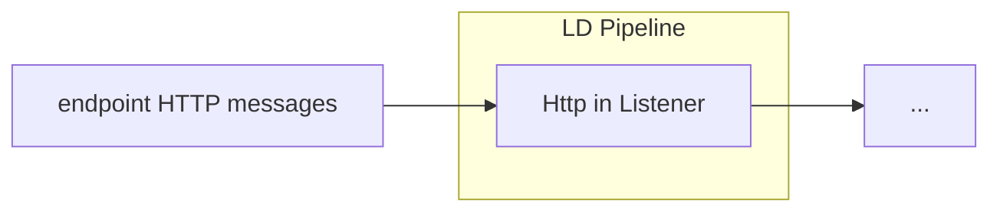

# LD Pipeline HTTP In
<b>LD Pipeline Component Name:</b> <i>```be.vlaanderen.informatievlaanderen.ldes.ldio.LdioHttpIn```</i>

<br>

The LD Pipeline HTTP In is a basic HTTP Listener. This component listens for HTTP messages at the endpoint ``http://{hostname}:{port}/{pipeline name}``.

It supports processing input in various content types, including XML (text/xml, application/xml), JSON (application/json), and RDF (text/turtle, application/ld+json, application/n-quads, application/n-triples, application/rdf+xml).

The expected output of this component is also in similar formats, supporting XML, JSON, and RDF content types.





## Config options

```yml
orchestrator:
  pipelines:
    -   name: example
        input:
          name: be.vlaanderen.informatievlaanderen.ldes.ldio.LdioHttpIn
          config:
```

This component has no required config