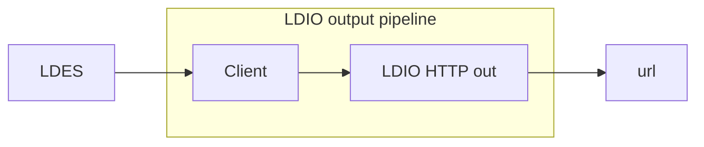

# LDIO HTTP Out

<b>LD Pipeline Component Name:</b> <i>```be.vlaanderen.informatievlaanderen.ldes.ldio.LdioHttpOut```</i>

<br>

The LDIO HTTP Out is a basic Http Client that will send the given Linked Data model to a target url. This pipeline component is responsible for sending harvested LDES members to an external destination (url) using the HTTP (Hypertext Transfer Protocol). HTTP is the foundational protocol used for transmitting data over the internet, primarily used for loading web pages in a browser, but it's also widely utilized in various other types of network communication.



## Example

```yml
- name: client-pipeline
  description: "Requests all existing members from a public LDES server and keeps following it for changes, sending each member as-is to a webhook"
  input:
    name: be.vlaanderen.informatievlaanderen.ldes.ldi.client.LdioLdesClient
    config:
      url: ${LDES_SERVER_URL}
      sourceFormat: application/n-quads
  outputs:
    - name: be.vlaanderen.informatievlaanderen.ldes.ldio.LdioHttpOut
      config:
        endpoint: ${SINK_URL}
        rate-limit:
          enabled: true
          max-requests-per-minute: ${MAX_REQUESTS_PER_MINUTE}
```

## Config options

| Property   | Description           | Required | Default      | Example                     | Supported values                                      |
| :--------- | :-------------------- | :------- | :----------- | :-------------------------- | :---------------------------------------------------- |
| endpoint   | Target url.           | Yes      | N/A          | http://example.com/endpoint | HTTP and HTTPS urls                                   |
| rdf-writer | LDI RDF Writer Config | No       | Empty Config | N/A                         | [LDI RDF Writer Config](../ldio-core/ldio-rdf-writer) |
