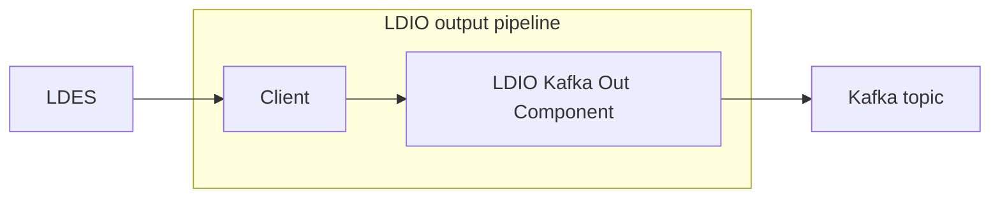

# LDIO Kafka Out

<b>LD Pipeline Component Name:</b> <i>```be.vlaanderen.informatievlaanderen.ldes.ldio.LdioKafkaOut```</i>

<br>

The LDIO Kafka Out sends messages to a [kafka topic](https://kafka.apache.org).




## Example

Two security protocols are supported:

### NO SECURITY

```yaml
outputs:
  - name: be.vlaanderen.informatievlaanderen.ldes.ldio.LdioKafkaOut
    config:
      bootstrap-servers: localhost:9092
      topic: quickstart-events
      key-property-path: <https://purl.org/geojson/vocab#properties>/<http://purl.org/dc/terms/title>
```

### SASL SSL PLAIN

```yaml
outputs:
  - name: be.vlaanderen.informatievlaanderen.ldes.ldio.LdioKafkaOut
    config:
      bootstrap-servers: localhost:9092
      topic: quickstart-events
      key-property-path: <https://purl.org/geojson/vocab#properties>/<http://purl.org/dc/terms/title>
      security-protocol: SASL_SSL_PLAIN
      sasl-jaas-user: client
      sasl-jaas-password: client-secret
```


## Config

| Property           | Description                                                           | Required | Default      | Example                                   | Supported values                                                                     |
| ------------------ | --------------------------------------------------------------------- | -------- | ------------ | ----------------------------------------- | ------------------------------------------------------------------------------------ |
| bootstrap-servers  | Comma separated list of uris of the bootstrap servers                 | Yes      | N/A          | localhost:9012                            | url                                                                                  |
| topic              | Name of the topic                                                     | Yes      | N/A          | quickstart-events                         | String                                                                               |
| key-property-path  | Optional property path to extract the kafka key from the data model   | No       | null         | <http://purl.org/dc/terms/title>          | [ARQ property path](https://jena.apache.org/documentation/query/property_paths.html) |
| security-protocol  | Security protocol to be used to connect to the kafka broker           | No       | NO_AUTH      | SASL_SSL_PLAIN                            | SASL_SSL_PLAIN or NO_AUTH                                                            |
| sasl-jaas-user     | Username used in the security protocol                                | No       | null         | client                                    | String                                                                               |
| sasl-jaas-password | Password used in the security protocol                                | No       | null         | secret                                    | String                                                                               |
| frame-type         | RDF type of the objects that need to be included for JSON-LD framing. | No       | N/A          | http://purl.org/goodrelations/v1#Offering | Any RDF type                                                                         |
| rdf-writer         | LDI RDF Writer Config                                                 | No       | Empty Config | N/A                                       | [LDI RDF Writer Config](../ldio-core/ldio-rdf-writer)                                |


<b>bootstrap-servers</b>: This is a list of host/port pairs used for establishing the initial connection to the Kafka cluster. For example, "host1:port1,host2:port2,...". It's the primary point of contact for a Kafka client and used to discover the full set of servers in the cluster. It is essential for the client to connect and perform operations in the Kafka environment.

<b>topic</b>: This refers to the name of the Kafka topic to which the client will produce or consume messages. Topics in Kafka are the categories or feed names where records are published. Each topic is split into partitions for scalability and redundancy.

<b>key-property-path</b>: In Kafka message structure, each record consists of a key, a value, and a timestamp. The key-property-path specifies the path to the property within the message payload that will be used as the key. Keys are important for partitioning in Kafka; records with the same key are sent to the same partition.

<b>security-protocol</b>: This parameter defines the protocol used to communicate with Kafka brokers. Common values are PLAINTEXT for unencrypted communication, SSL for encrypted communication, SASL_PLAINTEXT for authenticated communication over unencrypted channel, and SASL_SSL for authenticated communication over an encrypted channel.

<b>sasl-jaas-user and sasl-jaas-password</b>: These are used for SASL/PLAIN authentication. sasl-jaas-user is the username and sasl-jaas-password is the corresponding password. JAAS (Java Authentication and Authorization Service) provides a way for a Java application to authenticate and authorize a specific user or group of users to run it.

<b>frame-type</b>: This parameter is often used in the context of LDES (Linked Data Event Stream) and refers to the way data is structured or framed before it is sent to Kafka. It determines the format or structure of the data encapsulation in the Kafka message.

<b>rdf-writer</b>: This is relevant in scenarios where RDF (Resource Description Framework) data is being produced to or consumed from Kafka. The rdf-writer parameter specifies the format in which RDF data is serialized before it is published to a Kafka topic. Common RDF serialization formats include Turtle, N-Triples, RDF/XML, and JSON-LD.