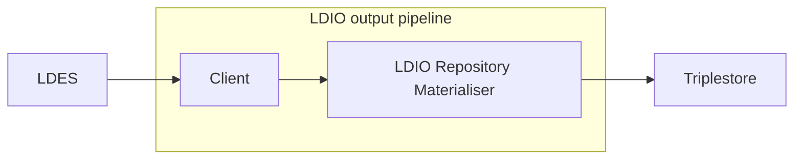

# Repository Materialiser

<b>LD Pipeline Component Name:</b> <i>```be.vlaanderen.informatievlaanderen.ldes.ldi.RepositoryMaterialiser```</i>

<br>

The repository materialiser is used to materialise an LDES stream into a triplestore.
Any triplestore that supports the RDF4J remote repository API can be used.

The Repository Materializer is a LD Pipeline component designed to efficiently transform an LDES (Linked Data Event Stream) member into a format suitable for storage and query within a triplestore. This tool is adaptable and can interface with any triplestore that is compatible with the RDF4J remote repository API. By leveraging this API, the materializer seamlessly integrates with the triplestore, ensuring that the LDES stream is accurately and efficiently converted into a triplestore-friendly format.



## Example

```yml
orchestrator:
  pipelines:
    - name: example
      output:
        name: be.vlaanderen.informatievlaanderen.ldes.ldi.RepositoryMaterialiser
        config:
          sparql-host: http://repositoryServer
          repository-id: repoId
          named-graph: http://name  
```

## Config

| Property      | Description                                  | Required | Default | Example                 | Supported values          |
| :------------ | :------------------------------------------- | :------- | :------ | :---------------------- | :------------------------ |
| sparql-host   | The url of the server hosting the repository | Yes      | N/A     | http://repositoryServer | URL                       |
| repository-id | The rdf4j repository id                      | Yes      | N/A     | repoId                  | String                    |
| named-graph   | The timestamp path used for naming the       | No       | N/A     | http://name             | Any valid LD subject name |

<b>repository-id</b>: This option specifies the unique identifier for the repository within the triplestore where the LDES stream will be materialized. It acts as a primary reference point for the tool to target the correct data storage and retrieval repository.

<b>sparql-host</b>: This parameter defines the host URL of the SPARQL endpoint. It's crucial for establishing a connection to the triplestore, enabling the tool to send SPARQL queries and updates directly to the specified endpoint. This host setting ensures that the materializer communicates with the correct triplestore instance over the network.

<b>named-graph</b>: This configuration option allows users to specify a particular named graph within the triplestore where the LDES data will be stored. Named graphs are a feature of SPARQL that enable storing and querying data in separate graph contexts within the same repository. This option provides flexibility and better organization of data by allowing the segregation of different LDES streams into distinct graph entities within the triplestore."