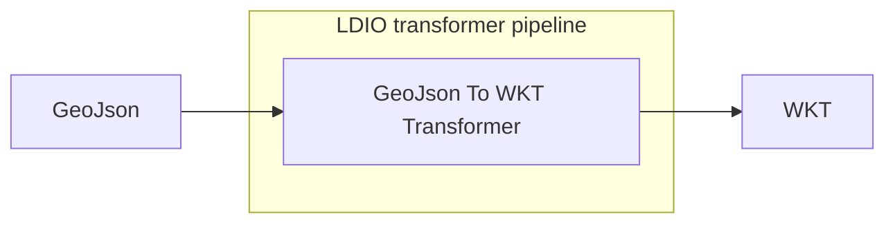

# LDIO GeoJson To WKT Transformer

<b>LD Pipeline Component Name:</b> <i>```be.vlaanderen.informatievlaanderen.ldes.ldi.GeoJsonToWktTransformer```</i>

<br>

The GeoJson to Wkt Transformer will transform any [GeoJson] statements (with predicate https://purl.org/geojson/vocab#geometry) to a [wkt string][WKT].




## Example

```yml
- name: example
  description: ""

  transformer:
    - name: be.vlaanderen.informatievlaanderen.ldes.ldi.GeoJsonToWktTransformer
       
```

## Config

This component has no required config


[GeoJson]: https://geojson.org/
[WKT]: https://libgeos.org/specifications/wkt/