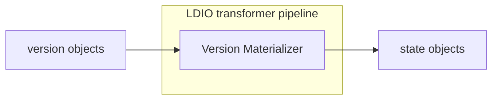

# LDIO Version Materializer

<b>LD Pipeline Component Name:</b> <i>```be.vlaanderen.informatievlaanderen.ldes.ldi.VersionMaterialiser```</i>

<br>

The Version Materializer will transform a Version Object into a State Object.



## Example

```yml
- name: example
  description: ""

  transformer:
    - name: be.vlaanderen.informatievlaanderen.ldes.ldi.VersionMaterialiser
      config:
        versionOf-property: http://purl.org/dc/terms/isVersionOf
        estrict-to-members: false 

```

## Config

| Property            | Description                                                                                                                                                            | Required | Default | Example                                | Supported values |
| :------------------ | :--------------------------------------------------------------------------------------------------------------------------------------------------------------------- | :------- | :------ | :------------------------------------- | :--------------- |
| versionOf-property  | Property that points to the versionOfPath.                                                                                                                             | Yes      | N/A     | "http://purl.org/dc/terms/isVersionOf" | String           |
| restrict-to-members | Builds a model limited to statements about the ldes:member, including potential nested blank nodes. Excludes statements about referenced entities, provided as context | No       | false   | false                                  | true or false    |
