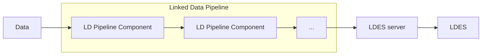
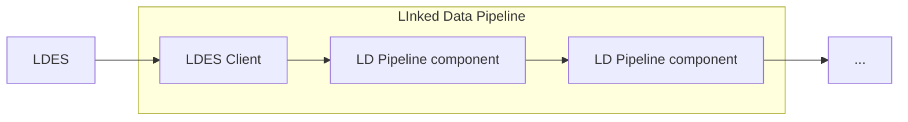

# Linked Data Pipeline

## Introduction

The Linked Data Pipeline is a pipeline that needs to be setup in order to facilitate the 
- transformation data to linked data so that the LDES server is able to publish the data as LDES
, or to  Linked Data more fluently by providing easy building blocks.
- consumtion, transformation, convertion of LDES members in a format, file or backend of choice.

This project was created in the frame of the [VSDS project]

{: .note }
The <b>LDES client</b> is a configurable component that is part of the LD Pipeline toolkit.

## LD Pipeline from non-linked data to linked data

The Linked Data Pipeline facilitate the efficient conversion and dissemination of data, aiming for a smooth integration into the LDES server.

## LD Pipeline from LDES to back-end

## Supported Frameworks

Currently, we support 2 frameworks to use these building blocks in:
* [Linked Data Interactions Orchestrator](ldio): A lightweight application maintained by the LDI team.
* [Apache Nifi][Apache NiFi]: A powerful system to easily process and distribute data

### Component support over frameworks

As the LDI team is rather small and focused on supporting the [VSDS project], we sometimes have to postpone full 
integration of our building blocks in all supported frameworks.

However, since the LDI project is open source, feel free to contribute and/or create issues at our [GitHub project][Linked Data Interactions]

[VSDS project]: https://www.vlaanderen.be/vlaamse-smart-data-space-portaal
[Apache NiFi]: https://nifi.apache.org/
[Linked Data Interactions]: https://github.com/Informatievlaanderen/VSDS-Linked-Data-Interactions